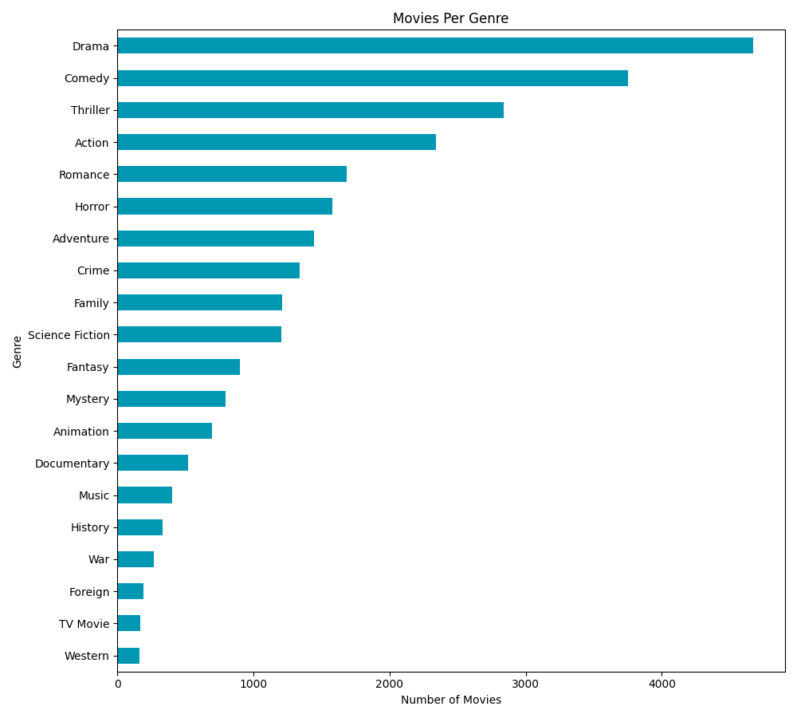
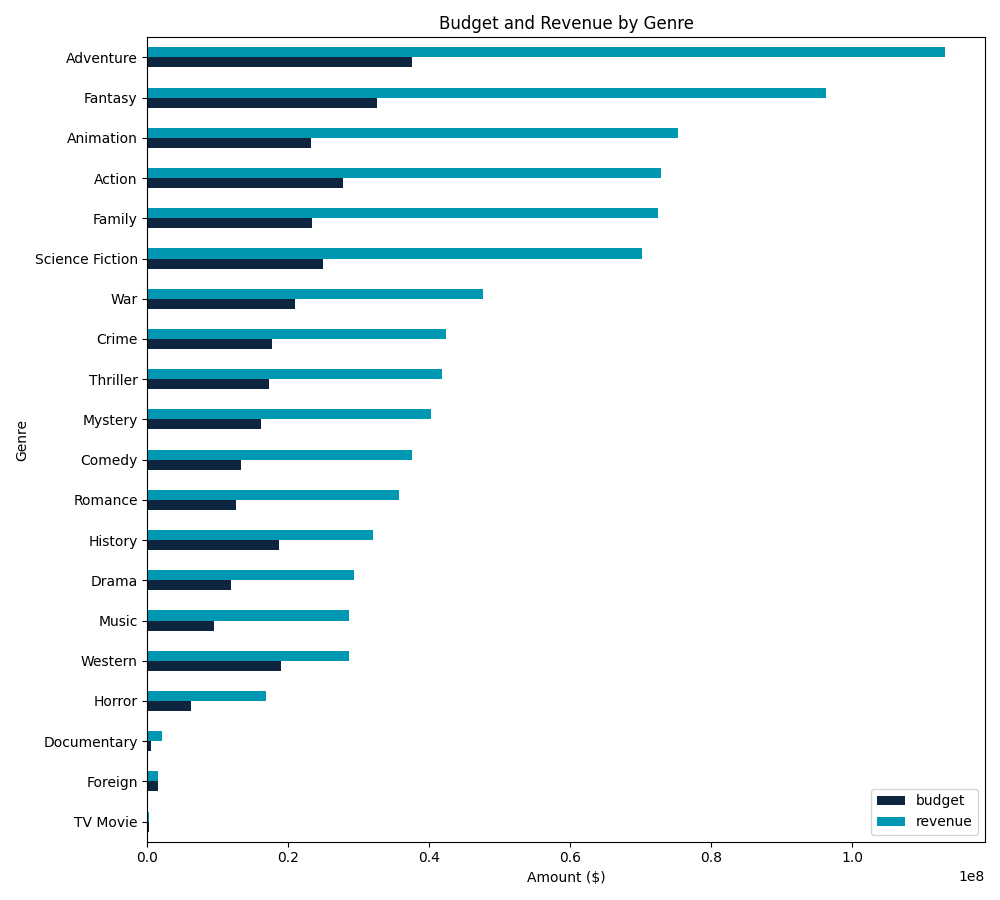
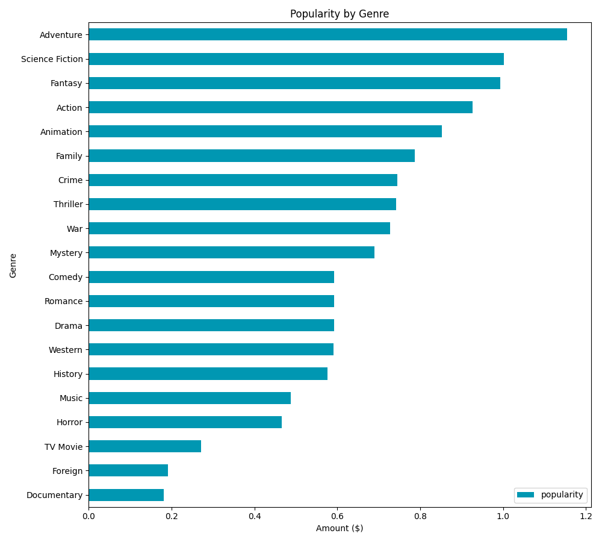
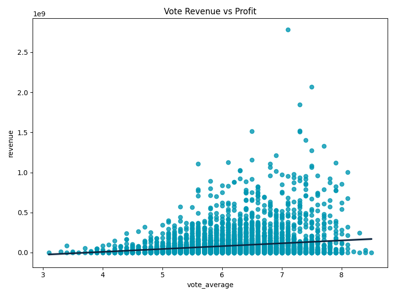
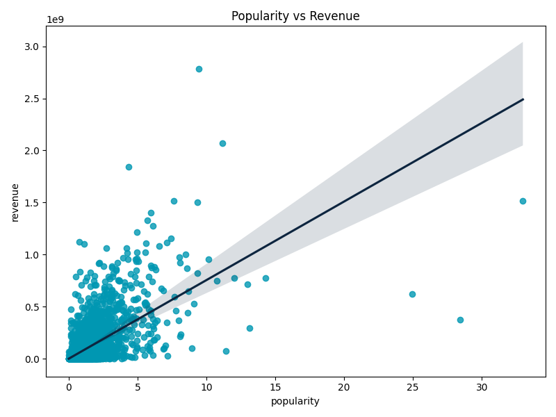
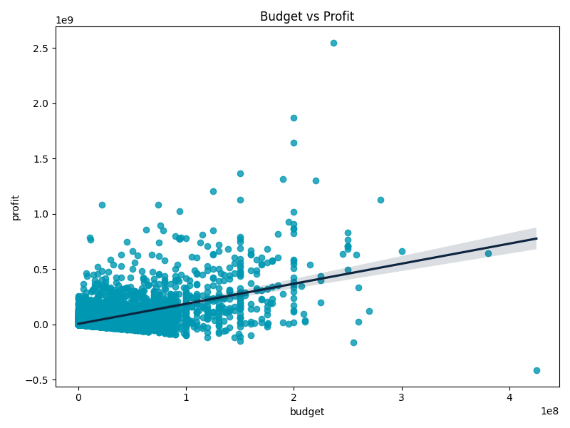
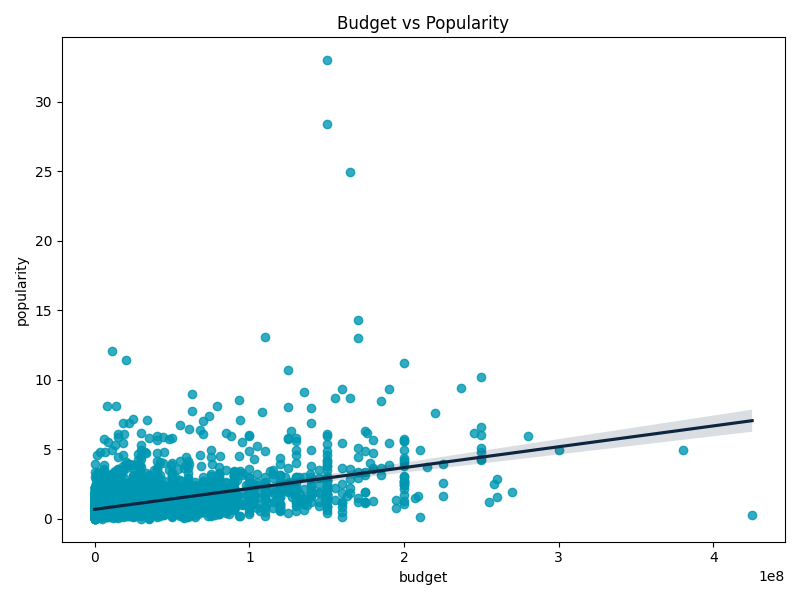
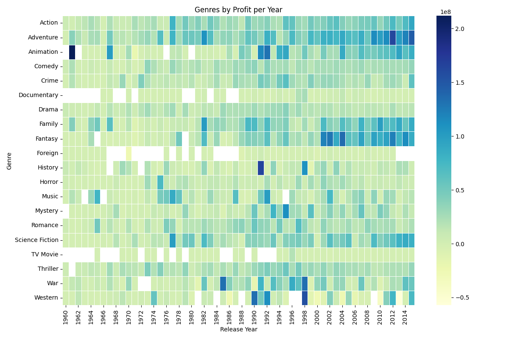

# Movie Genres Data Analysis Project

[](https://www.python.org/)
[](https://jupyter.org/)
[](https://github.com/your-username/movies-genre-analysis)

---

## Table of Contents
1. [Project Overview](#project-overview)  
2. [Research Questions](#research-questions)  
3. [Research Hypotheses](#research-hypotheses)  
4. [Data](#data)  
5. [Key Analyses](#key-analyses)  
6. [Conclusion](#conclusion)  
7. [Tools & Technologies](#tools--technologies)  
8. [How to Use](#how-to-use)  

---

## Project Overview
This project explores a dataset of movies to understand trends in genres, budgets, revenues, popularity, and voting patterns. The analysis is conducted using **Python (Pandas, Matplotlib, Seaborn)** in a Jupyter Notebook.
---

## Research Questions

1. Which genres are the most common (number of movies made)?  
   

2. Which genres have high average budget and revenue?  
   

3. Which genres have high average popularity? 
   

4. Which genres have the highest number of movies with a voting average >= 8?  
   

---
## Research Hypotheses
1. The best movies according to vote average return high profit and revenue.
    

2. The best movies according to popularity return high profit and revenue.
   

3. Highly budgeted movies return high revenue and profit. 
   

4. Highly budgeted movies have high popularity. 
    

5. Take a look at profit per genre per year
     

---
## Data
- **Movie Genres Data Analysis Project.ipynb** – Jupyter Notebook containing the analysis  
- **imdb_movies.csv** – Dataset with movie metadata including budget, revenue, vote counts, and genres  

---
## Key Analyses
- **Distribution of movies by genre** - top 3 are Drama, Comedy, Thriller. 
- **Average budget and revenue per genre** - top 3 genres with high average budget and revenue are Adventure, Fantasy, Action.
- **Popularity trends across genres** - high popularity are Adventure, Science Fiction, Fanntasy while the lowest are Documentary, Foreign and TV Movie.
- **Analysis of highly rated movies (vote_average >= 8)** - Documentary, Drama, Crime.
- Correlation between vote_average, vote_count, profit, and popularity  
- Visualizations including bar charts, scatter plots, regression plots, and heatmaps.  

---
## Conclusion
Through this project, I have demonstrated the ability to **clean, analyze, and visualize large datasets**, deriving actionable insights from movie industry data. This experience aligns closely with company interests by showing proficiency in:  
- **Data-driven decision making:** Identifying trends in profitability, popularity, and audience engagement across genres.  
- **Business insight generation:** Understanding which factors contribute to movie success, helping marketing, finance, and production teams optimize strategies.  
- **Data visualization & storytelling:** Communicating complex information clearly through charts, regression plots, and heatmaps.  
- **Analytical rigor:** Testing hypotheses and validating insights with statistical methods (e.g., correlations, regression analysis).  

These skills are directly relevant for companies looking to leverage **data for strategic planning, product development, and business growth**.  

---
## Tools & Technologies
- Python (Pandas, Matplotlib, Seaborn)  
- Jupyter Notebook  
- Git & GitHub for version control  

---
## How to Use
1. Clone the repository:  
```bash
git clone https://github.com/WinnieMadikizella/movies-genre-analysis.git
```
2. Open Movie Genres Data Analysis Project.ipynb in Jupyter Notebook.
3. Run the cells sequentially to explore the analyses and visualizations.
